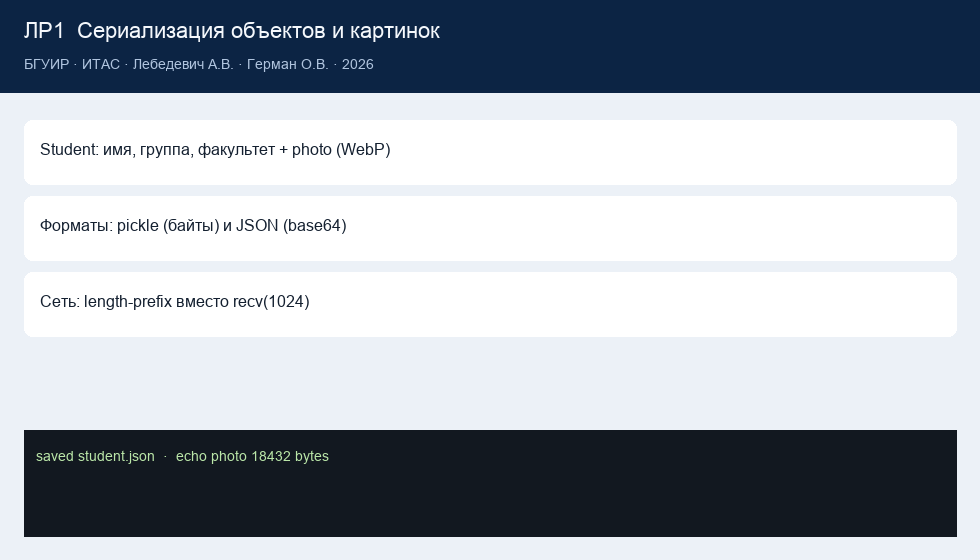

# Отчёт по лабораторной работе №1

**Учреждение образования**  
«Белорусский государственный университет информатики и радиоэлектроники»

Факультет информационных технологий и управления  
Кафедра информационных технологий автоматизированных систем

**Отчёт по лабораторной работе №1**  
по дисциплине «Технологии компонентного программирования»

**Тема:** сериализация и десериализация объектов (pickle, JSON, сеть, WebP/base64)

| | |
| --- | --- |
| Выполнил | магистрант 2 курса Лебедевич Артём Владимирович |
| Проверил | к.т.н., доцент Герман Олег Витольдович |
| Минск | 2026 |

---

## 1. Цель

Изучить сериализацию и десериализацию объектов Python, запись в файл, передачу по TCP и восстановление визуальной формы. Дополнительно — передать изображение WebP как сырые байты (pickle) и как base64 (JSON).

## 2. Ход работы

1. Класс `Student` с полями имя, группа, факультет и необязательным `Photo`.
2. Объект создаётся в GUI/CLI, фото берётся из `assets/samples/avatar.webp`.
3. Сериализация в `artifacts/student.pkl` и `artifacts/student.json`.
4. Десериализация «другим приложением»: `python -m lab1.reader`.
5. TCP-сервер и клиент с length-prefix (4 байта длины), не `recv(1024)`.
6. Снимок визуальной формы (кнопка + текстовое поле) через `GuiFormState.to_dict`.
7. Пункты 1–6 выполнены отдельно для pickle и JSON.

Код: [`lab1/`](../lab1/). Теория: [`labs_info/lab1_theory.md`](../labs_info/lab1_theory.md).

## 3. Передача картинки

- pickle кладёт в объект поле `data: bytes`;
- JSON кладёт `encoding: "base64"` и ASCII-строку;
- Pillow рисует превью, потому что wx может не открыть WebP;
- на приёме байты пишутся в `artifacts/` и снова показываются.

## 4. Результаты

CLI-прогон (`python main.py --lab 1`) сохраняет оба файла, читает их reader-ом и гоняет эхо по localhost:8003. Автотест `test_length_prefix_large_payload` проверяет кадр 5000 байт, `test_json_base64_roundtrip` — совпадение байтов WebP после JSON.

## 5. Выводы

Сериализация нужна, чтобы объект пережил процесс и сеть. pickle удобен внутри Python, JSON — на границе систем. Картинки в JSON живут только как base64. Длину кадра нельзя угадывать: её надо передавать явно.

## 6. Ответы на контрольные вопросы

1. **Что такое сериализация/десериализация?**  
   Превращение объекта в поток байтов и восстановление объекта из этого потока.

2. **Какие платформы используются для сериализации?**  
   В работе — pickle и JSON. В лекции ещё marshal; в других языках — Java Serializable, .NET BinaryFormatter/System.Text.Json, protobuf.

3. **В чём польза сериализации?**  
   Сохранение состояния, обмен между процессами и машинами, кэш, буфер сообщений.

4. **Можно ли сериализовать объект, у которого есть методы?**  
   Да. pickle запоминает класс и данные экземпляра; методы берутся из класса при загрузке. JSON сохраняет только данные, методы снова появляются, когда мы строим `Student` вручную.
