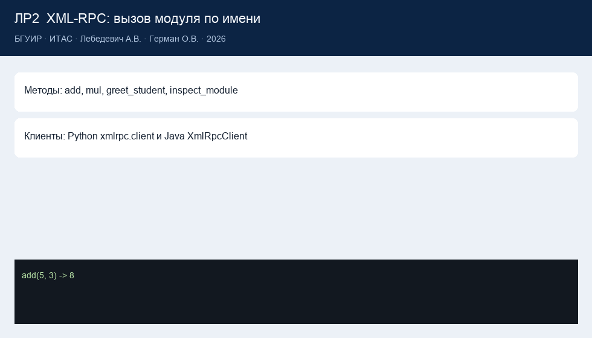

# Lab 2 report

**Institution**  
Belarusian State University of Informatics and Radioelectronics

Faculty of Computer Systems and Networks (FCSN), POIT, group PI

**Lab 2 report**  
Course: Component-Based Programming Technologies

**Topic:** remote module invocation (XML-RPC)

| | |
| --- | --- |
| Author | Artsem Lebiadzevich, year-2 MSc, FCSN, POIT, PI |
| Supervisor | Oleg German, PhD, Associate Professor |
| Minsk | 2026 |

---

## 1. Goal

Call functions that live in another process via XML-RPC. Show a Python client and a Java client with no third-party libraries.

## 2. Work done

1. `SimpleXMLRPCServer` on `127.0.0.1:8000`.
2. Methods: `add`, `mul`, `greet_student`, `inspect_module`, plus `system.listMethods`.
3. GUI cases call methods by name.
4. `lab2/java/XmlRpcClient.java` builds XML `methodCall` and HTTP POSTs it.
5. CGI from the lecture is theory only (`cgi` removed from current CPython).

Code: [`lab2/`](../lab2/). Theory: [`labs_info/lab2_theory.md`](../labs_info/lab2_theory.md).

## 3. Results

`python main.py --lab 2` yields `add(2, 3) = 5`, `mul(6, 7) = 42`, a greeting, and signatures. Tests start the server on port 18000.

## 4. Conclusions

RPC hides the network behind a method call. XML-RPC is a good teaching protocol (text, stdlib). Browsers usually speak REST; CGI is legacy.

## 5. Demo checklist

- start the server from a case and call `add`;
- `inspect_module` as a bridge to reflection;
- Java source; with a JDK, the “Java client” case.
