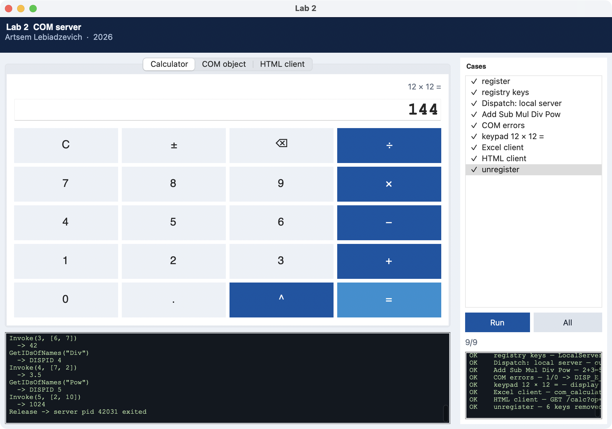

# Lab 2 report

**Institution**  
Belarusian State University of Informatics and Radioelectronics

Faculty of Computer Systems and Networks (FCSN), POIT, group PI

**Lab 2 report**  
Course: Component-Based Programming Technologies

**Topic:** COM server (calculator) and its clients

| | |
| --- | --- |
| Author | Artsem Lebiadzevich, year-2 MSc, FCSN, POIT, PI |
| Supervisor | Oleg German, PhD, Associate Professor |
| Minsk | 2026 |

---

## 1. Goal

Create a COM server in Python for addition, subtraction, multiplication, division and exponentiation, register it, and use it from other clients: a GUI calculator, Excel and an HTML page.

## 2. Work done

1. COM class `Calculator` (`Lab2.Calculator`, fixed CLSID, `_public_methods_ = Add, Sub, Mul, Div, Pow`).
2. Registration: ProgID → CLSID → LocalServer32 keys; unregister removes them.
3. Out-of-process server `python -m lab2.localserver {CLSID}`, started on activation, exits on `Release`.
4. Client `Dispatch("Lab2.Calculator")` with late binding: `GetIDsOfNames` → `Invoke`.
5. Part 1, calculator: wx keypad; every operation is a COM call, the trace is shown under the keypad.
6. Part 2, COM object: registry view, Register / Unregister / Dispatch / Release buttons, COM errors.
7. Excel client: VBA macro for Windows; CSV filled through the COM object on macOS.
8. HTML client: page + `/calc` endpoint that calls the COM object.

Code: [`lab2/`](../lab2/). Theory: [`labs_info/lab2_theory.md`](../labs_info/lab2_theory.md). Handout: `1OKT_2026/ЛЕК_ЛАБ_COM_ServerFFF.docm`.



## 3. Platform note

The lab was run on macOS, where COM and pywin32 do not exist. The GUI therefore runs on a portable model of COM with the same registry keys, activation and error codes (`lab2/registry.py`, `lab2/localserver.py`, `lab2/client.py`). The real pywin32 server and the VBA client are in [`lab2/windows/`](../lab2/windows/); they wrap the same `Calculator` class and were not run on this machine.

## 4. Results

`python main.py --lab 2` prints the registry keys, the call trace and:

```
arithmetic -> 2+3=5  7-10=-3  6*7=42  7/2=3.5  2^10=1024
com_errors -> 1/0 -> DISP_E_EXCEPTION, secret -> DISP_E_UNKNOWNNAME
html_client -> GET /calc?op=Pow&a=2&b=10 -> 1024
unregister -> 6 keys removed, Dispatch -> CO_E_CLASSSTRING; registered again
```

`python main.py --lab 2 --gui` opens the window; **All** passes 9/9 cases. Tests check that the server is a different process, the five operations, the three error codes and the HTML endpoint.

## 5. Conclusions

A COM client knows only a name. The registry maps the name to a server, the system starts it, and calls go through one generic interface. That is why the same calculator serves a wx keypad, a spreadsheet and a web page without any of them importing it.

## 6. Control questions

1. **What is a COM server and what is it for?**  
   A component that exposes objects through COM interfaces so that programs in other languages and processes can call it: Office automation, inter-process calls, reuse of legacy components.

2. **What is a CLSID and how is it created?**  
   A 128-bit GUID that identifies a COM class. Generate it once (`uuid.uuid4()`, `guidgen`, `pythoncom.CreateGuid()`) and keep it fixed; a new GUID on every run would leave stale registrations behind.

3. **Where is the CLSID stored in the registry?**  
   `HKEY_CLASSES_ROOT\CLSID\{...}` (a merged view of `HKLM\Software\Classes` and `HKCU\Software\Classes`); the ProgID key `HKEY_CLASSES_ROOT\<ProgID>\CLSID` points to it.

4. **How to integrate a COM server into a web application?**  
   A browser cannot create COM objects, so a server-side application (Flask or `http.server`) creates the object with `Dispatch`, calls it and returns the result to the page as HTML or JSON.

## 7. Demo checklist

- Calculator tab: `12 × 12 =`, then `1 ÷ 0 =` to show the COM error;
- COM object tab: Unregister, Dispatch fails, Register, Dispatch shows the server pid;
- HTML client tab: `2 ^ 10 =`;
- Excel client case opens the generated sheet.
