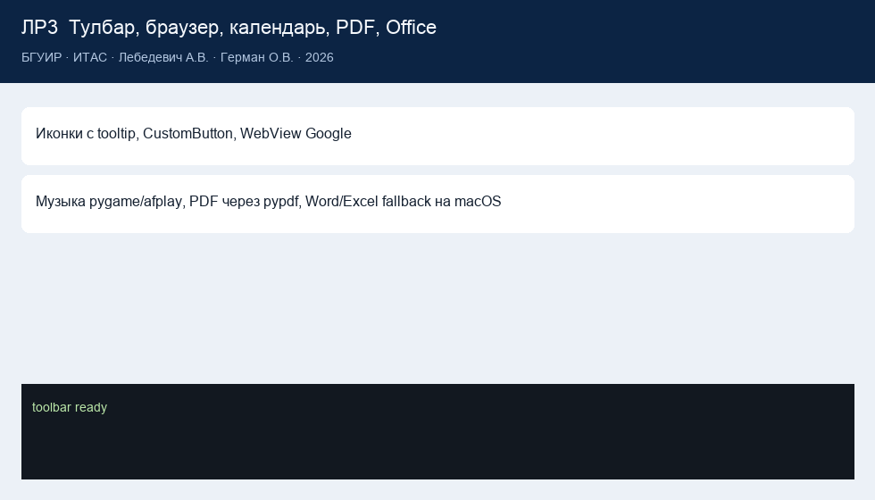

# Lab 3 report

**Institution**  
Belarusian State University of Informatics and Radioelectronics

Faculty of Computer Systems and Networks (FCSN), POIT, group PI

**Lab 3 report**  
Course: Component-Based Programming Technologies

**Topic:** wxPython components (toolbar, media, browser, Office, calendar, PDF)

| | |
| --- | --- |
| Author | Artsem Lebiadzevich, year-2 MSc, FCSN, POIT, PI |
| Supervisor | Oleg German, PhD, Associate Professor |
| Minsk | 2026 |

---

## 1. Goal

Assemble a desktop app from stock and custom wx widgets. Every toolbar item has an icon and a tooltip.

## 2. Work done

App: [`lab3/app.py`](../lab3/app.py).

| Tool | Action |
| --- | --- |
| Image | file dialog, Pillow preview |
| Music | pygame, fallback `afplay` |
| Browser | `wx.html2.WebView` → Google |
| Calendar | `wx.adv.CalendarCtrl`, live clock, Calendar.app |
| PDF | text via `pypdf`, open Preview |
| Word / Excel | Microsoft apps, else Pages/Numbers/TextEdit |

`CustomButton` subclasses `wx.Button` with BSUIR colours.

No ActiveX / IE on macOS. WebView replaces `InternetExplorer.Application`; `open -a` replaces WScript.Shell.

## 3. Results

`python main.py --lab 3` opens the window. CLI `run_lab3()` checks icons and extracts `assets/samples/sample.pdf`.

## 4. Conclusions

A component GUI is composition of widgets and thin subclasses, not a canvas of coordinates. wxPython is cross-platform; Word/Excel still depend on what is installed — say so in the report.

## 5. macOS fallback

Without Microsoft Office, Word opens in Pages or TextEdit, Excel in Numbers. That still matches “Activate Word / (or) Excel”.
