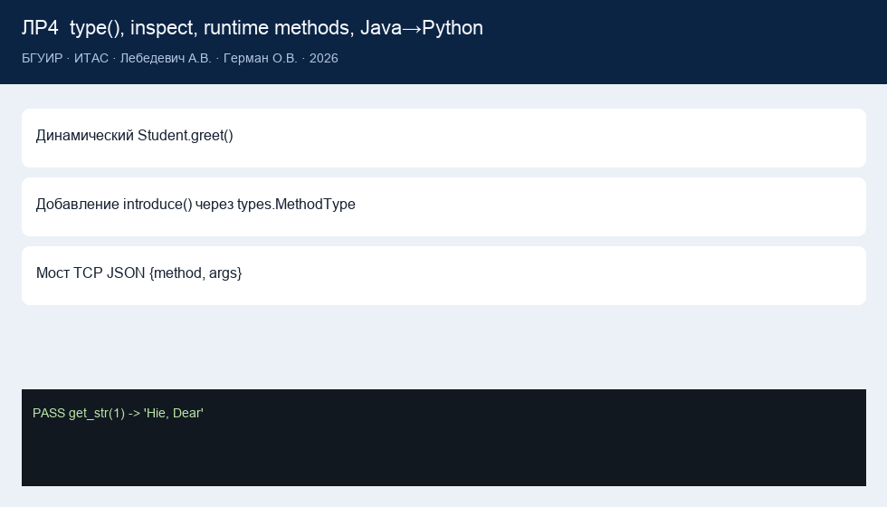

# Lab 4 report

**Institution**  
Belarusian State University of Informatics and Radioelectronics

Faculty of Computer Systems and Networks (FCSN), POIT, group PI

**Lab 4 report**  
Course: Component-Based Programming Technologies

**Topic:** reflection (dynamic class, inspect, runtime methods, Java→Python)

| | |
| --- | --- |
| Author | Artsem Lebiadzevich, year-2 MSc, FCSN, POIT, PI |
| Supervisor | Oleg German, PhD, Associate Professor |
| Minsk | 2026 |

---

## 1. Goal

Use Python reflection: create a class at runtime, list fields and signatures, add a method on the fly, accept a method name from Java. Also run methods with expected-output “annotations” (older Java handout).

## 2. Work done

1. `Student = type("Student", ..., {"greet": ...})`.
2. `inspect.getmembers` / `inspect.signature` work on that class.
3. `types.MethodType` binds `introduce(suffix)` on the instance.
4. `lab4/bridge_server.py` accepts JSON `{"method":"greet","args":[]}` and uses `getattr`.
5. `lab4/java/MethodSender.java` sends that JSON.
6. Decorator `@expected(input, output)` plus a method walk.

Code: [`lab4/`](../lab4/). Theory: [`labs_info/lab4_theory.md`](../labs_info/lab4_theory.md).

## 3. Results

`python main.py --lab 4` prints the inspect report, `introduce`, two PASS annotated tests, and the bridge reply. Tests cover `greet()` signature, both annotated methods, and the TCP protocol.

## 4. Conclusions

Debuggers, serializers, and RPC all receive member names as strings. `type()` is how Python builds ordinary classes. Java on the other end of the socket does not matter — the contract does.

## 5. Assignment map

| Handout item | Where |
| --- | --- |
| Dynamic Student + `greet()` | `lab4/dynamic_student.py` |
| Fields and signatures | GUI tree, `inspector.describe` |
| New method at runtime | “runtime method” case |
| Java sends a method | `MethodSender.java` + bridge |
| Annotations / several methods | `Probe.get_str`, `Probe.tag` |
